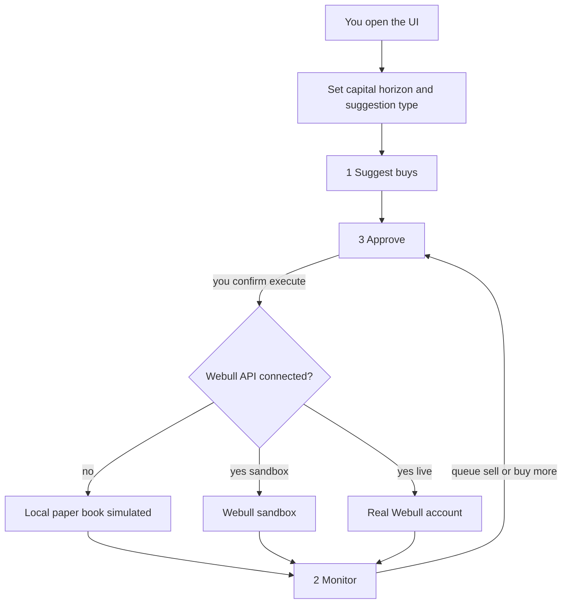
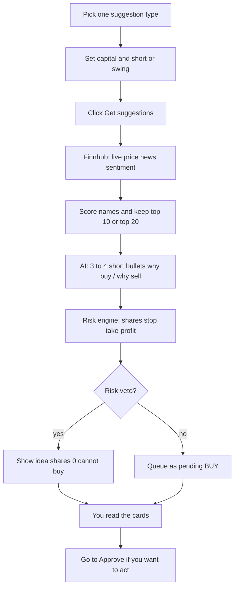
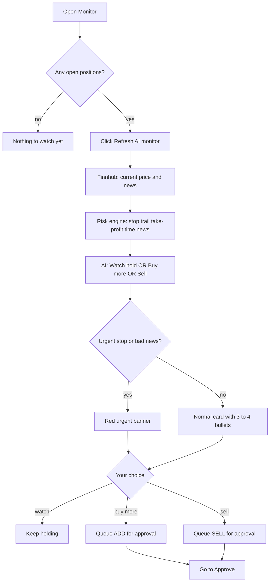
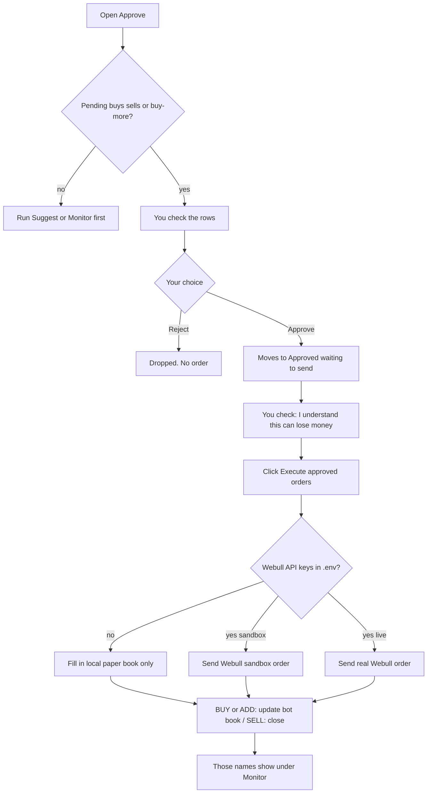
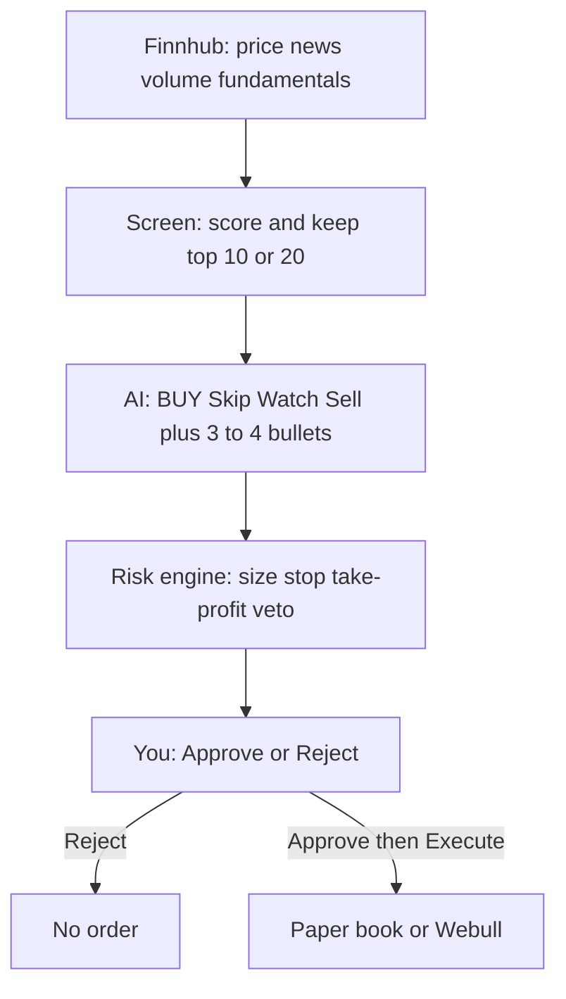
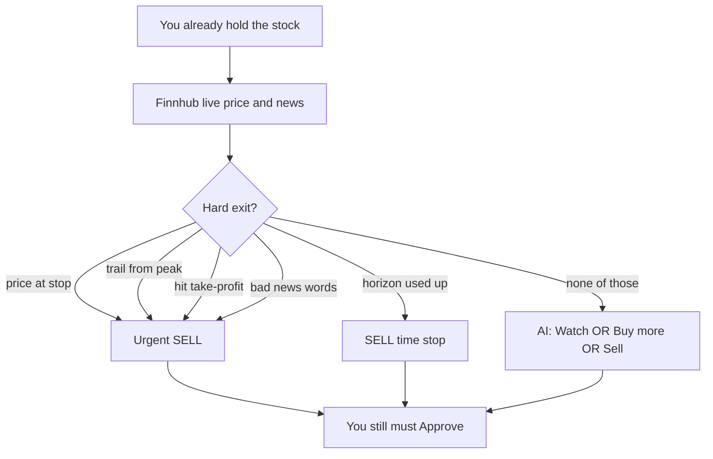

# How the trading bot flows

Nothing is bought or sold in Webull until you connect a Webull API and click execute. Until then, **Approve** writes to a **local paper book** on this PC (`data/bot_state.json`). That is a simulation, not a real brokerage fill.

## Saved book (next day)

The bot **saves and reloads**. Closing the UI, restarting the PC, or coming back tomorrow does **not** start a new empty book.

File on this PC: `data/bot_state.json`

| What | Still there tomorrow? |
| --- | --- |
| Open positions (after you Execute) | Yes, with live P&L on Monitor |
| Ideas you Approved but have not Executed | Yes, still on Approve |
| Pending buy ideas you have not decided | Yes, until you click **Get suggestions** again (that replaces undecided buys) |
| Closed trades / realized P&L | Yes |
| Last AI hold / buy-more / sell notes | Yes |

Do not delete `data/bot_state.json` if you want history. It is gitignored so it stays on your machine only.

## What happens if you approve with no Webull account

1. You approve a BUY or SELL and click **Execute**.
2. The bot looks for `WEBULL_APP_KEY` / `WEBULL_APP_SECRET` in `.env`.
3. **If those are empty:** it does **not** contact Webull. It records the fill in the **paper book** only. Monitor will show those fake positions. No money moves. No shares appear in the Webull app.
4. **If keys exist and sandbox is on:** orders go to Webull paper/sandbox.
5. **If Live is checked:** real money in your Webull account.

So: approve-without-Webull = practice mode. Connect Webull API later to trade for real.

---

## 1. Suggest buys

Three suggestion types (pick one):

- Top 10 best stocks **below $10**
- Top 10 best stocks **below $100**
- Top 20 best stocks **overall** (established names)

---

## 2. Monitor

For names you already hold, AI can say **Watch / hold**, **Buy more**, or **Sell**. Still no order until Approve.

---

## 3. Approve

---

## How buy and sell are decided

Nothing is bought or sold automatically. The bot **suggests**. You **approve**. Then Execute either fills the local paper book or (if Webull is connected) sends an order.

There are **three layers**:

1. **Screen** — ranks names from Finnhub prices, volume, news, and moving averages.
2. **AI** — ChatGPT (or a built-in heuristic if there is no OpenAI key) says BUY / Skip / Watch / Sell using only those facts. It does **not** invent headlines or promise profit.
3. **Risk engine** — hard rules the AI cannot override (size, stop, cash buffer, PDT, kill switch). If a rule fails, the idea still shows but **shares = 0** (veto).

You are the fourth layer. Reject anything you do not like.

### When it says BUY

A name must pass **all** of this:

| Step | What it looks at | Typical pass |
| --- | --- | --- |
| Universe | Your suggestion type | Below $10, below $100, or the Top 20 list |
| Liquidity | Price and average volume | Price at least **$2**, volume at least **500,000** shares |
| Screen | Momentum, SMA, volume surge, news tone, earnings date | Highest scores stay; junk is dropped |
| AI | Same facts + headlines | Action must be **BUY** (not Skip) |
| Confidence | AI confidence | At least **0.55** |
| Risk score | AI 1–10 | At most **7** |
| Earnings | Next report | Not inside **2 days** (gap risk) |
| News kill | Headlines | No fraud / bankruptcy / SEC charges / delist language |
| Book | Open names, cash, day trades | Under **max open names** (default 3), cash buffer left (default **20%**), kill switch off |
| Size | Capital × max % per name | Default **25%** of allocated capital, rounded down to whole shares |

If AI says Skip (AVOID) or Watch (HOLD), the card still appears so you can read the bullets, but the risk engine **blocks a live buy**.

**Stops and targets after a buy is sized**

| Horizon | Stop (sell if it falls) | Take-profit (sell if it rises) | Time stop |
| --- | --- | --- | --- |
| Short (~10 days) | about **-5%** | about **+6%** | **10** trading days |
| Swing (~1 month) | about **-7%** | about **+10%** | **22** trading days |

These are **scenarios**, not guarantees. A gap can skip the stop.

**Screen extras (how it ranks names)**

- **Short:** likes 10-day strength about 3–18%, price above the 20-day average, volume above average, constructive news.
- **Swing:** likes price above the 50-day average, positive 20-day trend, revenue growth, larger market cap, not too much debt.

### When it says SELL (or Watch / Buy more)

Monitor only looks at names you **already hold**.

| Signal | Meaning | What you see |
| --- | --- | --- |
| **Stop** | Price at or below the stop | Urgent SELL |
| **Trail** | Price ran up ~4%, then gave back ~3% from the peak | Urgent SELL |
| **Take-profit** | Price hit the target | Urgent SELL |
| **Time** | Held for the full horizon (10d or 22d) | SELL |
| **News** | Severe negative headline | Urgent SELL |
| **AI SELL** | Thesis broken or close to target | SELL checkbox |
| **AI ADD** | Thesis working and cash left | Buy-more checkbox (half-size add, still inside the 25% cap) |
| **AI HOLD** | No exit rule hit | Watch / hold |

Forced exits (stop, news) can sell even if the **minimum hold** is not over. Other sells wait:

- Short: at least **2** days
- Swing: at least **5** days

That is the pattern-day-trader (PDT) guard. Same-day buy-and-sell is blocked unless it is a forced exit.

### What the AI is told

Only structured Finnhub facts: live price, 10/20-day strength, above/below moving averages, volume, PE, revenue growth, debt, ROE, 52-week range, a few headlines, news sentiment, earnings date. Prompt rules: **do not invent data**, **prefer Skip when mixed**, **never promise profit**. If there is no OpenAI key, a scoring heuristic does the same job with weaker wording.

### What it will not do

- Raise your capital
- Send an order without your Approve + Execute
- Day-trade by default
- Guarantee a win (stops can gap; news can be late; AI can be wrong)
